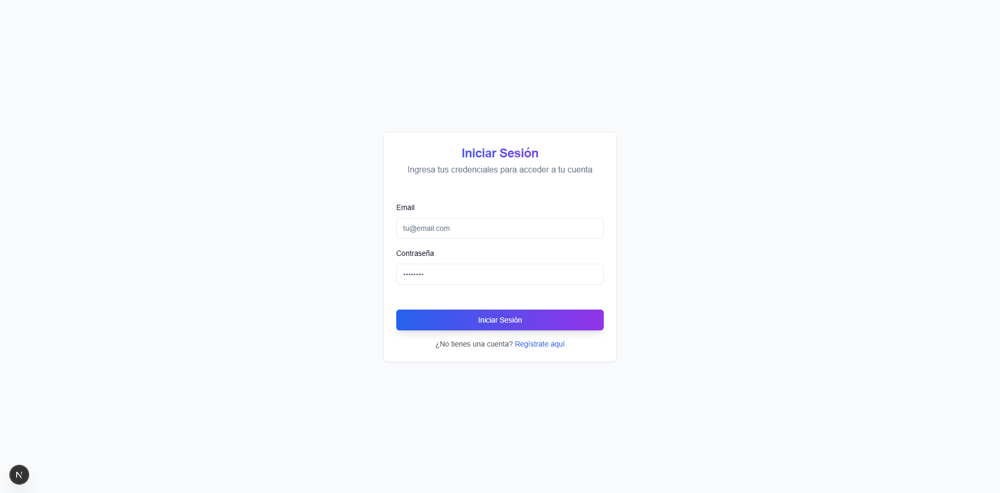
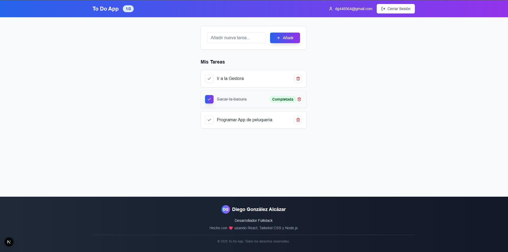

# ToDoList App

¡Bienvenido a mi primer proyecto con Node.js!

Este proyecto es una **aplicación ToDoList** desarrollada utilizando tecnologías modernas como **Express.js, MySQL, React y Tailwind CSS**. El objetivo principal fue aprender y aplicar conceptos clave de backend y frontend, así como familiarizarme con la arquitectura MVC.

---

## 📸 Capturas de la aplicacion




---

## 🚀 Tecnologías usadas

- **Backend:**
  - [Node.js](https://nodejs.org/)
  - [Express.js](https://expressjs.com/)
  - [MySQL](https://www.mysql.com/)
- **Frontend:**
  - [React](https://reactjs.org/)
  - [Tailwind CSS](https://tailwindcss.com/)
  
---

## 🏗 Arquitectura

Para mantener el código organizado y escalable, implementé una **arquitectura MVC (Modelo-Vista-Controlador)**:

- **Modelo:** Encargado de la gestión y manipulación de datos (MySQL).
- **Vista:** La interfaz de usuario construida con React y estilizada con Tailwind CSS.
- **Controlador:** Lógica que conecta la vista con el modelo, gestionando las peticiones y respuestas entre frontend y backend.

---

## 📋 Funcionalidades principales

- Crear tareas nuevas.
- Listar tareas existentes.
- Marcar tareas como completadas.
- Eliminar tareas.
- Interfaz limpia, responsive y moderna gracias a Tailwind CSS.

---

## 💡 Motivación y aprendizaje

Este proyecto representa mi primer acercamiento serio a Node.js y al desarrollo backend, integrando con un frontend dinámico y estilizado. Fue una oportunidad para entender cómo trabajar con bases de datos relacionales (MySQL) y manejar rutas, controladores y modelos en Express.js, además de practicar React y diseño con Tailwind.

---

## ⚙️ Instalación y ejecución

1. Clona el repositorio:
   ```bash
   https://github.com/dgonzalez-ops/ToDoList_Express.js.git

2. Instala la base de datos MySQL encontrada en /backend/config/db.sql
3. Crea un archivo .env dentro de la carpeta /backend siguiendo el .env.examples 
4. Instalar tanto el front como el back
    ```bash
    npm install
5. Levantar el front
    ```bash
    cd /frontend
    npm run dev
6. Levantar el back
    ```bash
    cd /backend
    node app.js